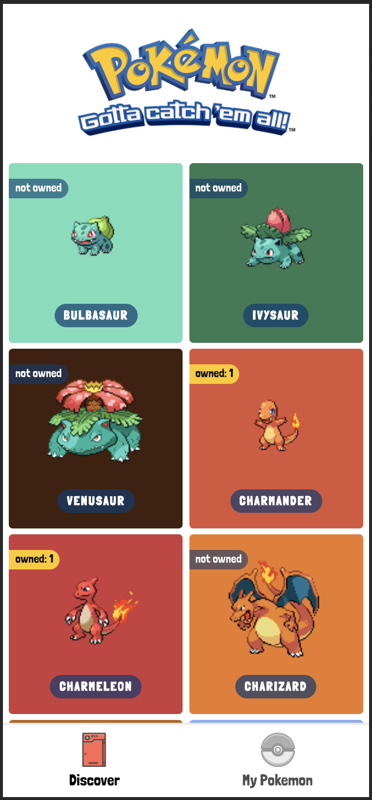
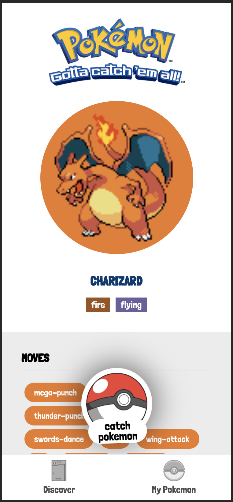
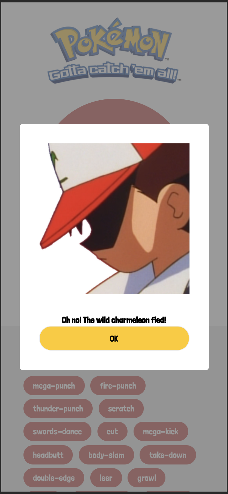
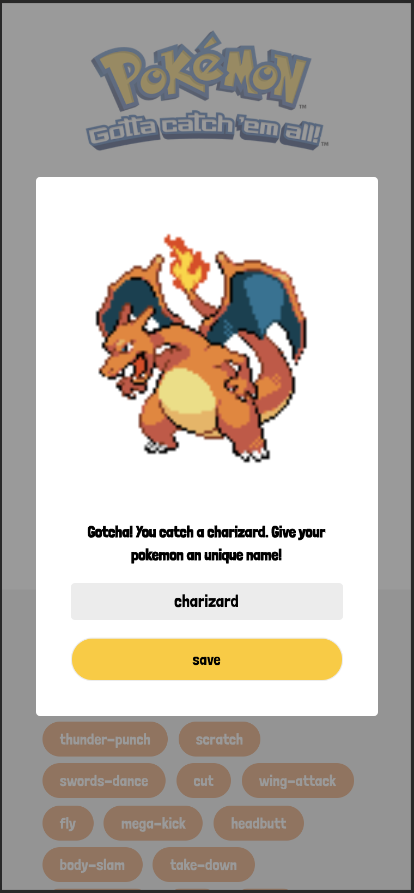
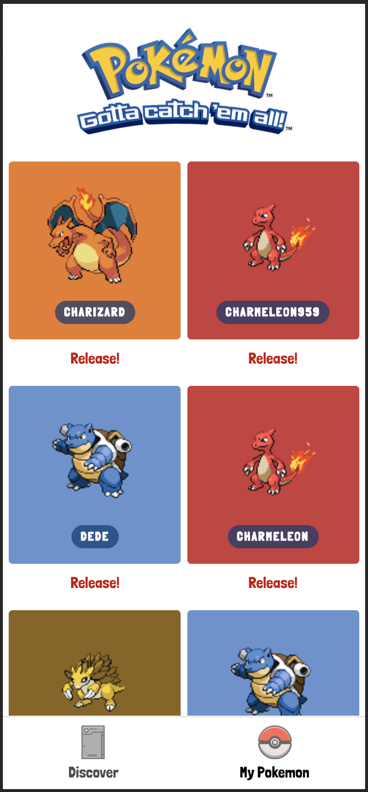
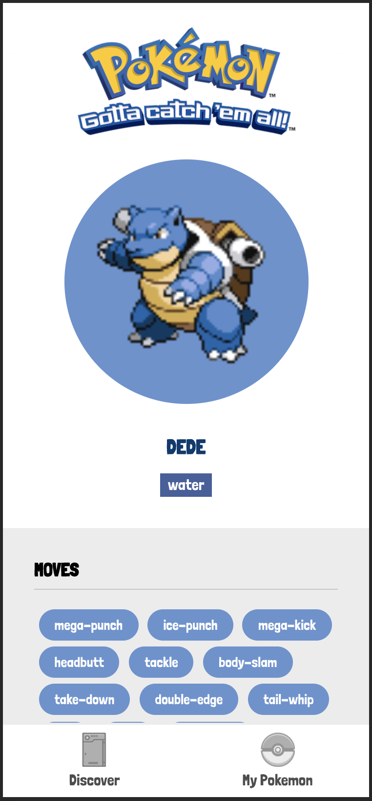
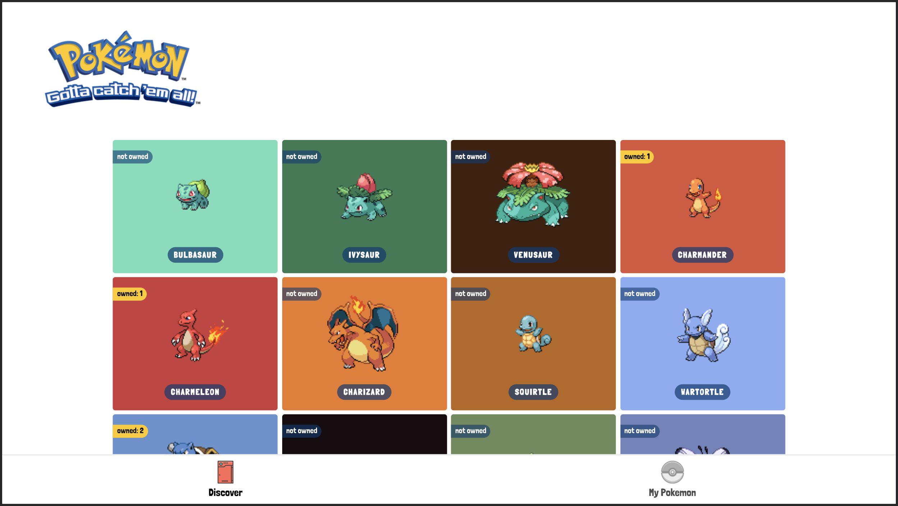
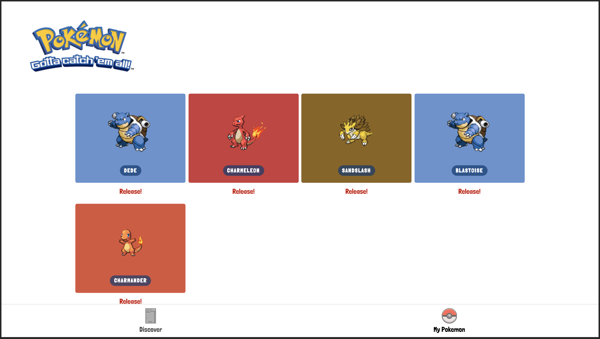

# Catch 'em all! | Pokemon Web App

<p>








</p>

## How to run this project

<strong><p>Run in development mode</p></strong>
```
npm run dev
```

<strong><p>Run in production mode</p></strong>
```
npm run build
```
This will generate static file for the project, you need to serve the static file inside `/out` directory

You can use simple http server like [this](https://www.npmjs.com/package/http-server). Then do this
```
npx http-server /out
```
The benefit of this, is you can try the `PWA` feature of the website localy. `PWA` is enabled in production mode only.

## The walkthrough
This project contains several features. Each features developed separately inside PRs. These are what I did step by step, click to see the work history inside the PR or click see deployment to see what I've done with the feature:

- [PR link](https://github.com/ptdede/catch-em-all/pull/1) for Setup Projects 
- [PR link](https://github.com/ptdede/catch-em-all/pull/2) for Pokemon List | [See Deployment](https://catch-em-all-4s81jl9s1-ptdede.vercel.app/)
- [PR link](https://github.com/ptdede/catch-em-all/pull/3) for Pokemon Detail | [See Deployment](https://catch-em-all-cd7jefsyg-ptdede.vercel.app/)
- [PR link](https://github.com/ptdede/catch-em-all/pull/4) for Catch a Pokemon | [See Deployment](https://catch-em-all-ktfw25ydv-ptdede.vercel.app/)
- [PR link](https://github.com/ptdede/catch-em-all/pull/5) for My Pokemon List | [See Deployment](https://catch-em-all-a7sto8r5a-ptdede.vercel.app/)
- [PR link](https://github.com/ptdede/catch-em-all/pull/7) for PWA | [See Deployment](https://catch-em-all-git-improvement-lighthouse-audit-ptdede.vercel.app/)
- And finally, the complete project | [See Web App](https://pokemon.ptdede.me)

<!-- 
## The Project Structure

```
.
|-- .github
|   `-- contain template and automation for repository
|-- components
|-- constants
|-- containers
|-- database
|-- graphql
|-- helpers
|-- hooks
|-- libs
|-- pages
|-- providers
|-- styles
``` -->

